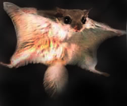

# lb1-html
<!DOCTYPE html>
<html>
<head>
	<meta charset="UTF-8"/>
	<title>Белка-летяга</title>
</head>
<body bgcolor="#EEC591">

	<h1>
Обычная летяга</h1>
	

	

		
<strong>Обыкновенная летяга</strong>, или <strong>белка-летяга</strong>, или <strong>летучая белка</strong> <i>(Pteromys volans)</i> — небольшой грызун семейства <a href="https://ru.wikipedia.org/wiki/%D0%91%D0%B5%D0%BB%D0%B8%D1%87%D1%8C%D0%B8">беличьих</a>. Видовое название <a href="https://ru.wikipedia.org/wiki/%D0%9B%D0%B0%D1%82%D0%B8%D0%BD%D1%81%D0%BA%D0%B8%D0%B9_%D1%8F%D0%B7%D1%8B%D0%BA">лат.</a> <i>volans</i> означает «крылатый» либо «летучий», «летающий».

		<h2><b>Содержание</b></h2>
		<ol>
			<a href="#view"><li>Внешний вид</a></li>
			<a href="#pitanie"><li>Образ жизни и питание</a></li>
			<a href="#razmnojenie"><li>Размножение</a></li>
			<a href="#chislo"><li>Численность</a></li>
			<a href="#link"><li>Источник</a></li>
		</ol>

		
<h3>Внешний вид</h3>

		
Белка-летяга внешне похожа на небольшую короткоухую белку, но между передними и задними лапами у неё имеется широкая кожная складка, покрытая шерстью — <a href="https://ru.wikipedia.org/wiki/%D0%9B%D0%B5%D1%82%D0%B0%D1%82%D0%B5%D0%BB%D1%8C%D0%BD%D0%B0%D1%8F_%D0%BF%D0%B5%D1%80%D0%B5%D0%BF%D0%BE%D0%BD%D0%BA%D0%B0">летательная перепонка</a>. Спереди она поддерживается длинной серповидной косточкой, идущей от запястья и приблизительно равной по длине предплечью. В отличие от других летяг, у обыкновенной летяги нет летательной перепонки между задними ногами и основанием хвоста. Хвост длинный, опушен густым длинным мехом.

		
Мех у белки-летяги густой, мягкий, шелковистый, значительно нежнее и гуще, чем у белки. Верх тела окрашен в серебристо-серый цвет, часто с охристым или бурым оттенком, низ тела — белый с палевым налётом. Глаза окружены чёрным ободком. Хвост очень пушистый, светлее тела; волосы на нём имеют слабый «расчёс» в стороны. Зимняя шерсть особенно пышная, различных оттенков серого. Линяет летяга дважды в год подобно белке и в том же порядке.

		
Выделяют до 10-12 подвидов белки-летяги, отличающихся особенностями окраски; из них в России водятся 9 подвидов:

		<table border="1" width="100%" cellpadding="5">
			<tr>
				<th>Подвид:</th>
				<th>Место обитания:</th>
			</tr>
			<tr>
				<td>Pteromys volans volans Linnaeus</td>
				<td>Север Европейской части РФ, Урал</td>
			</tr>
			<tr>
				<td>Pteromys volans ognevi Stroganov</td>
				<td>Центр Европейской части РФ</td>
			</tr>
			<tr>
				<td>Pteromys volans gubari Ognev</td>
				<td>лесостепи Западной Сибири и Казахстана</td>
			</tr>
			<tr>
				<td>Pteromys volans betulinus Serebrennikov</td>
				<td>восток Западной Сибири и Прибайкалье</td>
			</tr>
			<tr>
				<td>Pteromys volans turovi Ognev</td>
				<td>Алтай, Саяны, Забайкалье, среднее течение Амура</td>
			</tr>
			<tr>
				<td>Pteromys volans athene Thomas</td>
				<td>низовья Амура, Сахалин</td>
			</tr>
			<tr>
				<td>Pteromys volans incanus Miller</td>
				<td>Север и восток Якутии</td>
			</tr>
			<tr>
				<td>Pteromys volans arsenjevi Ognev</td>
				<td>Центральная Якутия и Приморье</td>
			</tr>
			<tr>
				<td>Pteromys volans anadyrensis Ognev</td>
				<td>бассейн Анадыря</td>
			</tr>
		</table>
		

		
<h4>Образ жизни и питание</h4>

		
Летяга населяет старые лиственные и смешанные леса с примесью осины, березняки и ольшаники. В хвойных лесах редка, предпочитает участки с примесью лиственных пород, особенно берёзы и ольхи. В лесостепи селится в ленточных борах и берёзовых колках.

		
		
Животное активно круглый год. Образ жизни ночной и сумеречный, кормящие самки и молодняк появляются и днём. Большую часть времени летяга проводит в поисках пищи. Гнёзда строит в естественных дуплах деревьев, гнездовых дуплах дятлов, старых гнёздах белок и сорок, изредка в расщелинах скал. Дупла выбирает на высоте 3‒12 м. Иногда селится возле жилья, в скворечниках. Гнёзда у летяги круглые, сложенные из мягких лишайников, мхов, сухой травы. В гнёздах летяги часто селятся по двое. Они — неагрессивные социальные животные и не обладают выраженными индивидуальными участками, только привычными кормовыми маршрутами. Кормящие самки более агрессивны и защищают свои гнёзда.

		
Основу рациона летяги составляют почки различных лиственных пород, верхушки побегов, молодая хвоя, семена хвойных (сосны, лиственницы), летом — также грибы и ягоды. Иногда обгладывает тонкую молодую кору ивы, осины, берёзы, клёна. Главный же её корм — ольховые и берёзовые серёжки. Их летяга запасает на зиму, складывая в дупле. Предположительно, может поедать также птенцов и птичьи яйца. Её рацион варьирует в зависимости от местообитания.

		
В холодное время года активность летяги резко снижается. В спячку не впадает, но морозные дни проводит в гнезде, используя сделанные запасы корма.

		

		
<h4>Размножение</h4>

		
		
Размножение летяги изучено плохо. У самки один раз в год рождается по 2—4 детёныша. Беременность длится 4—5 недель. Первый выводок появляется в апреле-мае, второй — в конце июня — начале июля. Детёныши голые и слепые; прозревают в 15-дневном возрасте. На 36—41 день жизни впервые выходят из гнезда. По достижении 43—45-дневного возраста начинают совершать первые прицельные прыжки, с 50-дневного — планировать. После 50 дня жизни полностью переходят на взрослое питание и становятся самостоятельны.

		
Живут летяги (в неволе) до 9—13 лет, в природе — всего 5 лет. Их природные враги — крупные совы, реже соболь, куницы.

		

		
<h4>Численность</h4>

		
Численность белки-летяги мала, охота на неё ограничена. Мех малоценен. Несмотря на красоту и мягкость меха, у него очень тонкая и непрочная мездра, что затрудняет его использование.

		
Ископаемые остатки обыкновенной летяги известны лишь с конца позднего плейстоцена, хотя остатки других видов семейства летяговых впервые появляются с миоцена, а расцвет семейства приходится на миоцен-плиоцен.

		
Вид занесён в Красные книги некоторых регионов.

		

		
<h5>Источник:</h5>

		
<a href="https://ru.wikipedia.org/wiki/%D0%9E%D0%B1%D1%8B%D0%BA%D0%BD%D0%BE%D0%B2%D0%B5%D0%BD%D0%BD%D0%B0%D1%8F_%D0%BB%D0%B5%D1%82%D1%8F%D0%B3%D0%B0">Википедия</a>

</body>
</html>
